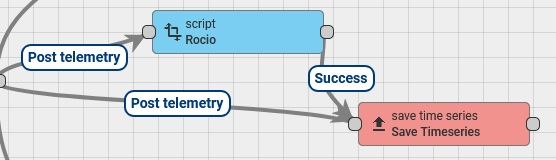

# Tool for upload and operate with telemetry in ThingsBoard

This repository contains, in one hand a **Python script** for upload telemetry data from **CSV file** to platform including the calculation of **Hourly Maximum Oscillation (MoH)** for visualization. Additionally, a **chat bot-based tool** is offered to make it more **user-friendly** and **comfortable**.

In the other hand contains a **rule chain model** for make **aggregations** with an example of calculation of Hourly Maximum Oscillation (MoH).

# Instance of ThingsBoard CE

### Documentation

- [API for MoH](docs/MoH.md)

### Features

* Loads telemetry data from a CSV file for multiple sensors.
* Automatically calculates Hourly Maximum Oscillation (MoH) for each hour.
* Supports multiple telemetry keys.
* Allow the posibility of choose a subset of data divided into days, months or years. 
* Integrates with ThingsBoard Community Edition (CE) without the need for special rule nodes.


### Requirements

* **Python 3.x**
* **A ThingsBoard instance (CE or PE)**
* **Access to the ThingsBoard API with a device token**


### Installation

1.  **Clone the repository:**
    ```bash
    git clone https://github.com/carnestoltes/chartsThingsBoard.git
    cd chartsThingsBoard/CE
    ```

2.  **Install dependencies:**
    ```bash
    pip install pandas requests argparse
    ```

### Usage

To run the script, use the terminal and provide the necessary arguments.

* **To check the options:**
    ```bash
    python3 MoH.py -h
    ```

* **To check the columns in your CSV:**
    ```bash
    python3 MoH.py --csv <path/to/your/file.csv> --list-columns
    ```
    
* **To upload subset of data from CSV:**
    ```bash
    python3 MoH.py --csv <path/to/your/file.csv> --keys "Relative humidity" "Temperature" --token <your-token> --time-filter "7D"
    ```

* **To upload telemetry and calculate MoH:**
    ```bash
    python3 MoH.py --csv <path/to/your/file.csv> --keys "Relative humidity" "Temperature" --token <your-token> --time-filter "all" --moh
    ```

### ThingsBoard Widget Configuration

To visualize MoH data, you need a custom bar chart widget in ThingsBoard. 

1.  Create a new **"Time-Series Bar Chart"** widget.
2.  On the **Data Keys** tab, configure your telemetry key (for example, 'Temperature') or you can choose the calculated MoH for display.


_Diferents charts options for display it._


_The final result._

## Chat-Bot based tool from Telegram

You should give in the part of **main** the **token ID** from chatbot because without token don't works the tool.

```bash
    bot_token = ""
   ```
### Documentation

- [API for MoHBot](docs/MoHBot.md)

### Requirements

* **Python 3.x**
* **A ThingsBoard instance (CE or PE)**
* **Access to the ThingsBoard API with a device token**
* **Access to the Telegram chatbot API with a chat token**


### Installation

1.  **Clone the repository:**
    ```bash
    git clone https://github.com/carnestoltes/chartsThingsBoard.git
    cd chartsThingsBoard/CE
    ```

2.  **Install dependencies:**
    ```bash
    pip install pandas requests argparse python-telegram-bot
    ```

### Usage

To run the script, use the terminal, execute and go to the chat for start.

* **To set your token chat ID:**
  
  Edit the script and change in the **main** section this line with your token:
  
    bot_token = ""

* **To run the chatbot:**
    ```bash
    python3 MoHBot.py 
    ```

* **To start the process into the chat:**
    ```bash
    /start
    ```

* **To cancel the process into the chat:**
    ```bash
    /cancel
    ```
If you complete the process, you should see a similar image like this:


# Instance of ThingsBoard PE

In this section, we can appreciate how you can make an aggregations for exploit your raw data using only a rule chain.

**Note:** Be sure to modify the names of your telemetry variables within the nodes, as well as the derived data, if you wish to change the name of the parameterization.
If you only **wants** a rule chain **.json** for import, you should follow this steps:

* **Go to the directory:**
    ```bash
    git clone https://github.com/carnestoltes/chartsThingsBoard.git
    cd chartsThingsBoard/PE
    ```
Just download and that it's all.

### Display of  MoH rule chain 


_A visual reference of rule chain implementing aggregation for exploit the raw data._


_Another one._

### Display of dewpoint rule chain 



_A visual reference of rule chain implementing script node for exploit the raw data._

