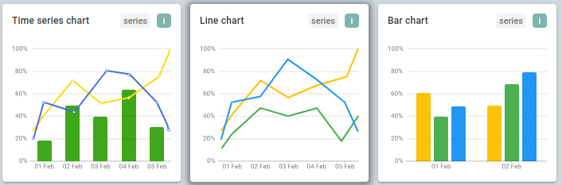

# Tool for upload and operate with telemetry in ThingsBoard

This repository contains, in one hand a **Python script** for upload telemetry data from **CSV file** to platform including the calculation of **Hourly Maximum Oscillation (MoH)** for visualization.

In the other hand contains a **rule chain model** for make **aggregations** with an example of calculation of Hourly Maximum Oscillation (MoH).

# Instance of ThingsBoard CE

### Features

* Loads telemetry data from a CSV file for multiple sensors.
* Automatically calculates Hourly Maximum Oscillation (MoH) for each hour.
* Supports multiple telemetry keys.
* Integrates with ThingsBoard Community Edition (CE) without the need for special rule nodes.


### Requirements

* **Python 3.x**
* **A ThingsBoard instance (CE or PE)**
* **Access to the ThingsBoard API with a device token**


### Installation

1.  **Clone the repository:**
    ```bash
    git clone https://github.com/carnestoltes/chartsThingsBoard.git
    cd chartsThingsBoard/
    ```

2.  **Install dependencies:**
    ```bash
    pip install pandas requests argparse
    ```

### Usage

To run the script, use the terminal and provide the necessary arguments.

* **To check the options:**
    ```bash
    python3 MoH.py -h
    ```

* **To check the columns in your CSV:**
    ```bash
    python3 MoH.py --csv <path/to/your/file.csv> --list-columns
    ```

* **To upload telemetry and calculate MoH:**
    ```bash
    python3 MoH.py --csv <path/to/your/file.csv> --keys "Relative humidity" "Temperature" --token <your-token> --moh
    ```

### ThingsBoard Widget Configuration

To visualize MoH data, you need a custom bar chart widget in ThingsBoard. 

1.  Create a new **"Time-Series Bar Chart"** widget.
2.  On the **Data Keys** tab, configure your telemetry key (for example, 'Temperature') or you can choose the calculated MoH for display.



Diferent chart options for display it.


The final result.

# Instance of ThingsBoard PE

In this section, we can appreciate how you can make an aggregations for exploit your raw data using only a rule chain.

### Display of rule chain 


A visual reference of rule chain implementing aggregation for exploit the raw data.


Another one.

